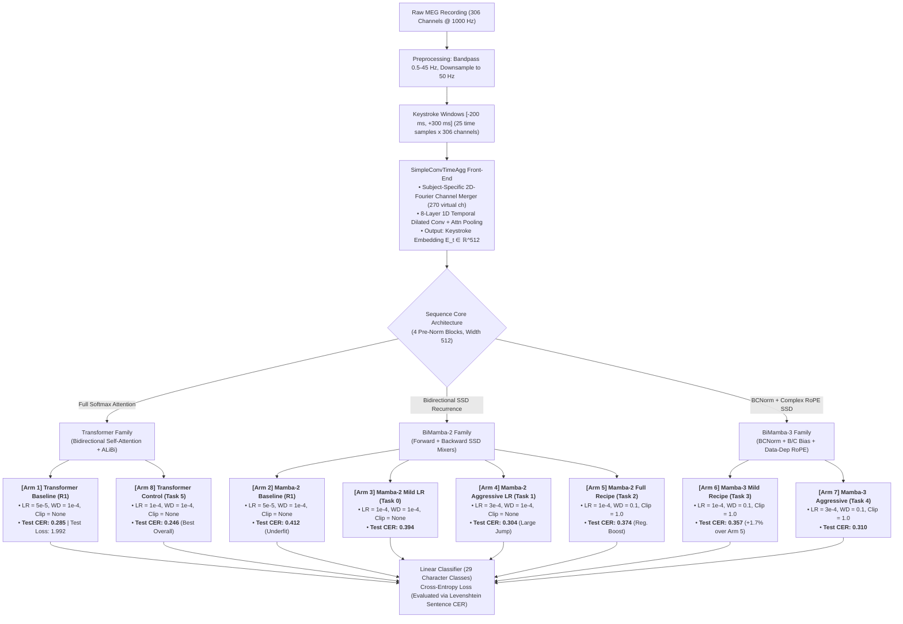
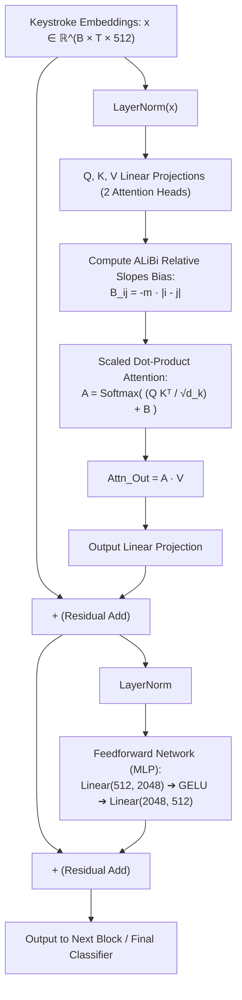
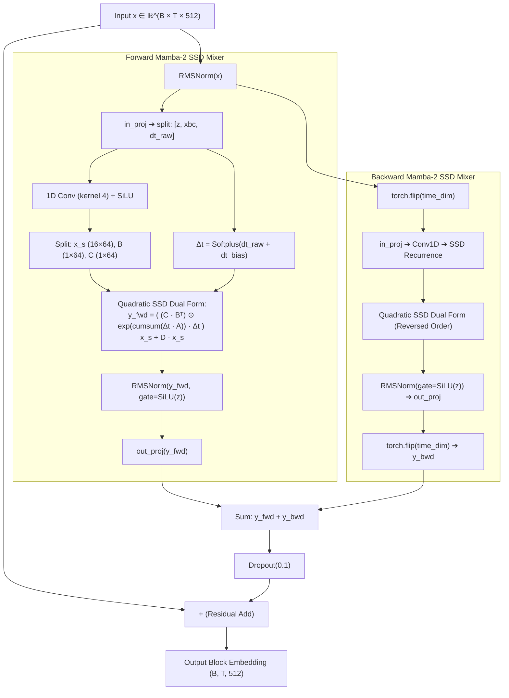
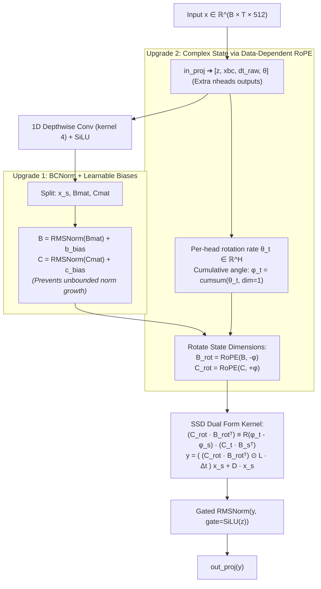

# Brain2Qwerty: 8 Architectural Ablations Flowcharts

This document provides visual Mermaid flowcharts capturing the end-to-end architectural differences across all 8 experimental ablation arms evaluated on the SpanishBCBL 3-subject dataset ($S15, S16, S6$).

---

## 1. Master Architectural Hierarchy & Ablation Decision Tree

---

## 2. Transformer Block (Arms 1 & 8)

---

## 3. BiMamba-2 Pre-Norm Block (Arms 2, 3, 4, 5)

---

## 4. BiMamba-3 Block Upgrades (Arms 6 & 7)

