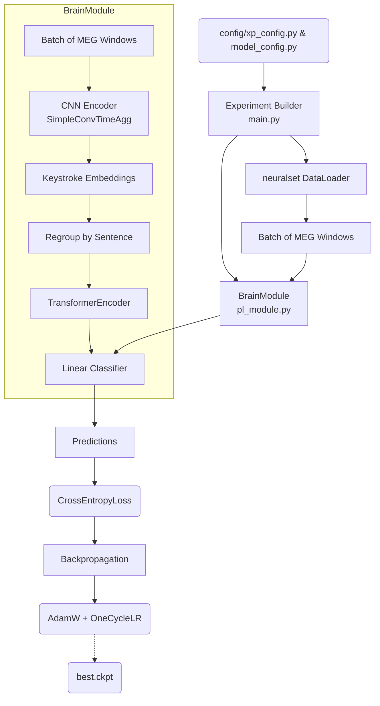

# Architecture Diagram

```mermaid
graph TD
    Config(config/xp_config.py & model_config.py) --> ExpBuilder[Experiment Builder<br>main.py]
    
    ExpBuilder --> Data[neuralset DataLoader]
    ExpBuilder --> Model[BrainModule<br>pl_module.py]
    
    Data --> Batch[Batch of MEG Windows]
    Batch --> Model
    
    subgraph BrainModule
        Batch2[Batch of MEG Windows] --> CNN[CNN Encoder<br>SimpleConvTimeAgg]
        CNN --> KeystrokeEmbs[Keystroke Embeddings]
        KeystrokeEmbs --> Regroup[Regroup by Sentence]
        Regroup --> Transformer[TransformerEncoder]
        Transformer --> Linear[Linear Classifier]
    end
    
    Model --> Linear
    Linear --> Predictions
    
    Predictions --> Loss(CrossEntropyLoss)
    Loss --> Backprop[Backpropagation]
    Backprop --> Optimizer(AdamW + OneCycleLR)
    
    Optimizer -.-> Checkpoint(best.ckpt)
```
