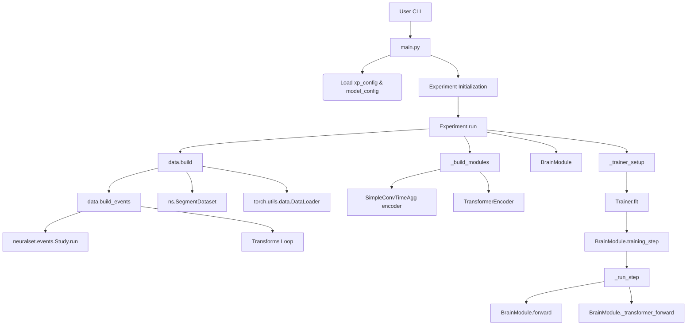

# Call Graph

```mermaid
graph TD
    CLI[User CLI] --> Main[main.py]
    
    Main --> Config(Load xp_config & model_config)
    Main --> ExpInit[Experiment Initialization]
    
    ExpInit --> Run[Experiment.run]
    Run --> BuildData[data.build]
    
    BuildData --> BuildEvents[data.build_events]
    BuildEvents --> NSRun[neuralset.events.Study.run]
    BuildEvents --> Transforms[Transforms Loop]
    BuildData --> Segment[ns.SegmentDataset]
    BuildData --> DataLoader[torch.utils.data.DataLoader]
    
    Run --> BuildModules[_build_modules]
    BuildModules --> CNN[SimpleConvTimeAgg encoder]
    BuildModules --> Trans[TransformerEncoder]
    
    Run --> PlModuleInit[BrainModule]
    Run --> TrainerSetup[_trainer_setup]
    
    TrainerSetup --> TrainerFit[Trainer.fit]
    TrainerFit --> TrainingStep[BrainModule.training_step]
    
    TrainingStep --> RunStep[_run_step]
    RunStep --> Fwd[BrainModule.forward]
    RunStep --> TransFwd[BrainModule._transformer_forward]
```
