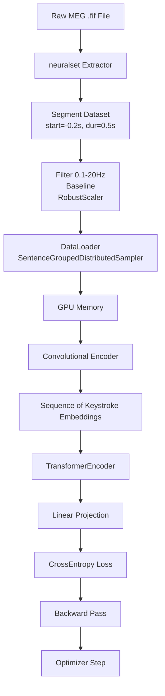

# Data Flow Diagram

```mermaid
graph TD
    Raw[Raw MEG .fif File] --> Neuralset[neuralset Extractor]
    Neuralset --> SegmentDataset[Segment Dataset<br>start=-0.2s, dur=0.5s]
    SegmentDataset --> Prep[Filter 0.1-20Hz<br>Baseline<br>RobustScaler]
    Prep --> Batching[DataLoader<br>SentenceGroupedDistributedSampler]
    Batching --> GPU[GPU Memory]
    
    GPU --> Encoder[Convolutional Encoder]
    Encoder --> Embs[Sequence of Keystroke Embeddings]
    Embs --> Transformer[TransformerEncoder]
    Transformer --> Proj[Linear Projection]
    Proj --> Loss[CrossEntropy Loss]
    
    Loss --> Backprop[Backward Pass]
    Backprop --> Optimizer[Optimizer Step]
```
